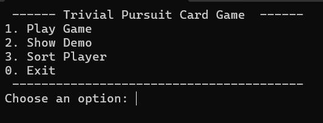

# TRIVIAL-PURSUIT-CARD-GAME---DS
Data Structure &amp; Algorithm C++

Data structure
array - load players, questions from csv to array
linked list - manage player turns, question order from deck
stacks - filtering players from waiting list
tree - efficient sorting and prioritization of player score
graph,queue - find common question category relationship between players
hash tables/ binary - store game result

Algorithm
binary search - find the top 30 players
BSF - find common category of question
insertion sort - sorting player name by letter
Fisher-Yates Shuffle algorithm - shuffle deck with same %

